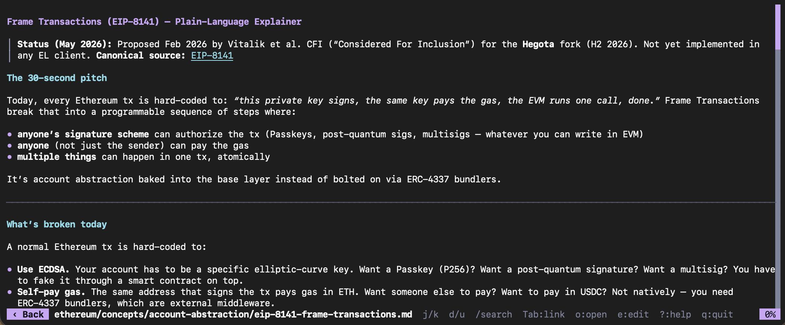
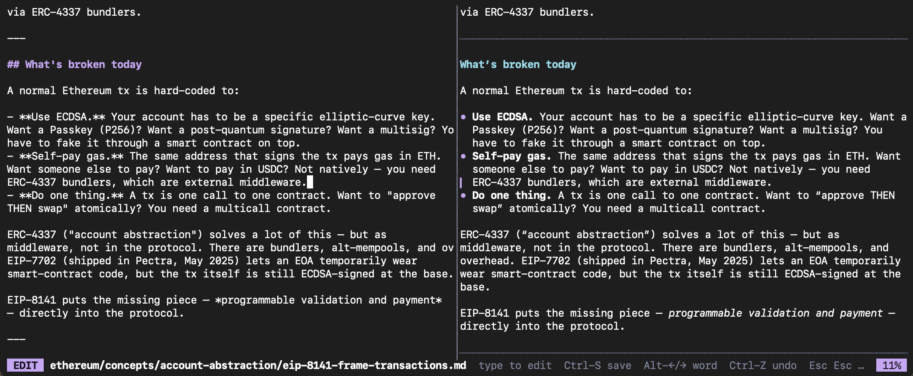

# md

A terminal markdown reader with a built-in HackMD-style split editor.
Built with Rust + [ratatui](https://ratatui.rs).



Also features a HackMD-style markdown editor — raw on the left, live preview on the right, with synced mouse scroll.



## Install

```sh
cargo install md-tui-rs
```

Or from a local checkout:

```sh
cargo install --path .
```

The binary is named `md`.

## Use

```sh
md                # browse the current directory
md README.md      # open a file
md config.json    # any text file — opens with syntax highlighting
md docs/          # browse a directory
cat NOTES.md | md # read from stdin
```

## Features

- **Mouse-aware** — wheel to scroll, click links to follow, hover for highlight, click `‹ Back` in the header.
- **Clickable task lists** — click `- [ ]` / `- [x]` to toggle; the file is rewritten in place.
- **Native text selection** — press `m` to drop mouse capture and drag-select with the terminal.
- **In-document search** — `/` in Reader, then `n`/`N` to step matches; `T` for fuzzy file search.
- **Directory browser** — full-screen one-level listing; `Enter`/`→` opens or descends, `Esc`/`←` walks back; gitignore-aware.
- **Wiki links** — `[[Page]]` / `[[Page|Display]]` resolve relative to the current file or anywhere under the launch root.
- **Image rendering** — kitty / iTerm2 / sixel / unicode halfblocks via `ratatui-image` when supported.
- **HackMD-style split editor** — press `e` to edit; raw markdown on one side, live preview on the other, with synced scroll. `Ctrl-S` saves, `Esc` exits (twice if dirty).
- **Header bar** — current path with a clickable back button.
- **Proportional scrollbar** — thumb size reflects how much of the document is visible.
- **History** — `h`/`l` (or `b`/`f`) walk back and forward; cursor and scroll position are remembered.
- **Themes** — Catppuccin Mocha / Latte; auto-selects from `COLORFGBG`, override with `-s dark|light`.
- **GitHub-flavored** — tables, strikethrough, footnotes, task lists, code-block syntax highlighting (syntect), heading anchors.
- **Reads any text file** — `.json`, `.jsonl`, `.yaml`, `.toml`, `.rs`, `.py`, `.sh`, plain `.txt`, and more — opened as a single syntax-highlighted code block.

## Keys

| Key            | Action                                                 |
| -------------- | ------------------------------------------------------ |
| `j` / `k`      | Scroll down / up                                       |
| `d` / `u`      | Half page down / up                                    |
| `g` / `G`      | Top / bottom                                           |
| `Tab` / `S-Tab`| Next / previous link                                   |
| `Enter` / `→`  | Open file / enter directory / follow link              |
| `Esc` / `←`    | Back (parent directory or previous view)               |
| `/`            | In-doc search (Reader) / fuzzy file search (Browser)   |
| `n` / `N`      | Next / previous in-doc match                           |
| `T`            | Fuzzy file search (anywhere)                           |
| `o`            | Open focused link in system browser                    |
| `e`            | Edit current file in `$EDITOR`                         |
| `h` / `l`      | Back / forward in history                              |
| `m`            | Toggle mouse capture (drag-to-select)                  |
| `?`            | Help                                                   |
| `q` / `Ctrl-C` | Quit                                                   |

## Config

Optional `md/config.toml` under your platform config dir
(`~/.config/md/config.toml` on Linux, `~/Library/Application Support/md/config.toml`
on macOS):

```toml
theme = "dark"        # "dark" | "light" | "auto"
width = 0             # word-wrap width; 0 = terminal width
line_numbers = false
```

CLI flags override the config: `-s dark|light|auto`, `-w 100`, `-l`.

## License

[MIT](LICENSE)
